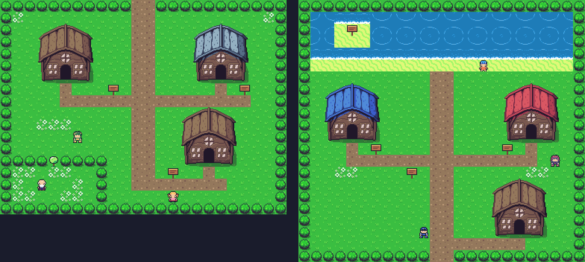
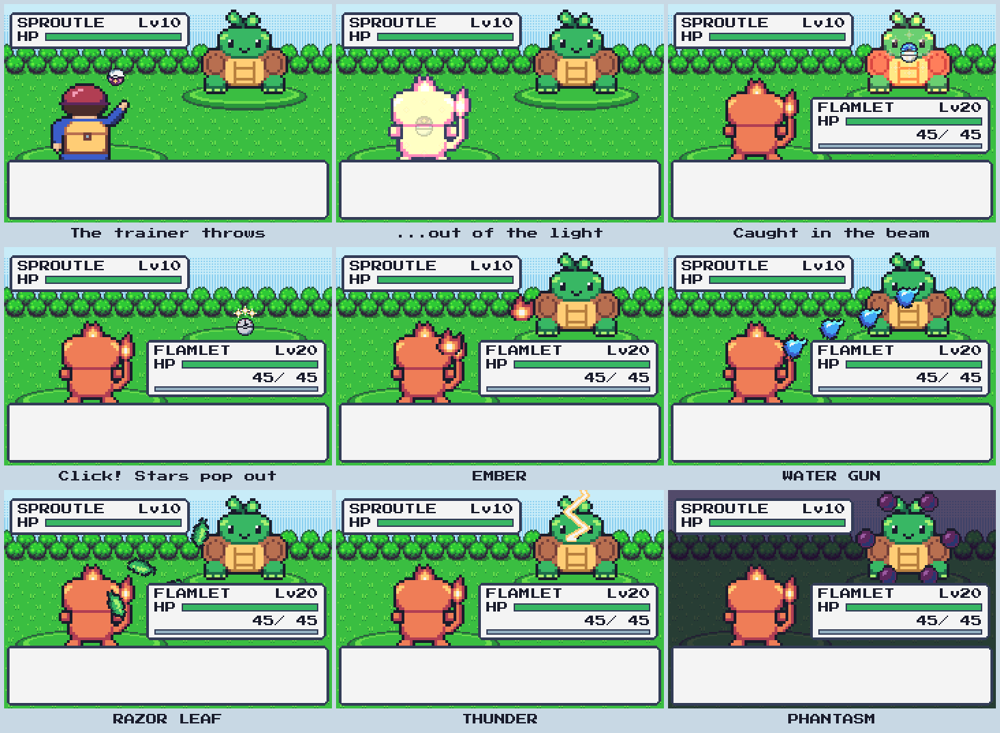
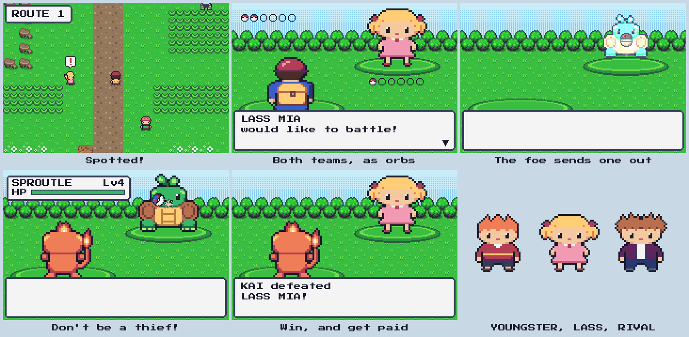
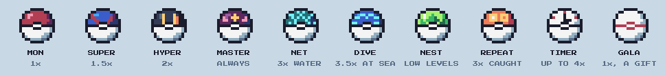
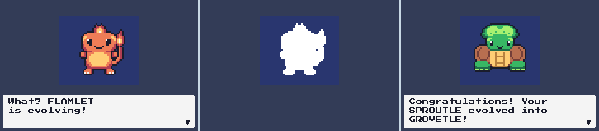

# Mythic Mons

An 8-bit, top-down monster-collecting RPG in the spirit of Pokémon Emerald,
built with **Godot 4.7** and GDScript.


So far: tile-locked movement, a multi-town world, dialogue, field moves,
a starter from the local professor, animated turn-based battles against
wild monsters and trainers (including your rival), unique abilities, EXP and
level-ups, evolution, catching with ten kinds of orb, a MONDEX, a MART, a
party screen, and saving.
The world (towns, routes, interiors, signs and the battle backdrop) is built
from ArMM1998's CC0 overworld tileset, with matching pieces drawn for this
project in its colors. The characters, monsters, items, battle effects,
chiptune music and sound effects are made in code, and five townsfolk come
from a CC0 character sheet.
Real assets slot in later without code changes.

## Quick start

1. Install [Godot 4.7](https://godotengine.org/download) (standard build, no .NET needed).
2. Open `project.godot` in Godot and press **F5**.

| Action | Keyboard | Gamepad |
|---|---|---|
| Move | Arrows / WASD | D-pad / left stick |
| Run (hold) | Shift or X | B |
| Talk / confirm (A) | Z or Space | A |
| Cancel (B) | X or Backspace | B |
| Start menu | Enter or Esc | Start |

## What's in the prototype



Two towns and one route so far. Every building can be entered, and every
NPC and sign can be talked to (`tests/npc_test.gd` checks each one). Press A
on bookshelves, beds, plants, crates and MART shelves to examine them.

- **Emberfall Town.** Your house, where MOM heals your team; REN's house
  next door; and PROF. ASTER's lab (slate roof), where you choose FLAMLET,
  AQUAPUP or SPROUTLE. The professor won't let you into the tall grass
  without one. There's also a secret garden behind a **CUT** tree.
- **Route 1.** Tall grass with wild encounters, one-way **ledges**, a
  hiker trapped behind a **ROCK SMASH** boulder, and three trainers: LASS
  MIA, YOUNGSTER TIM, and your rival REN guarding the way north.
- **Tidewater City.** A beach and an island you reach with **SURF**, a
  seaside house, the **MONSTER CENTER** (red roof), where the nurse heals
  your team for free and the PC in the corner manages the BOX, and the
  **TIDEWATER MART** (blue roof). Like a
  department store, it has two counters: talk to a clerk across one to BUY
  or SELL. The lower clerk sells MON, SUPER and HYPER ORBs, potions and
  status cures ($100 to $1200). The upper one sells the specialty orbs ($1000) and evolution
  stones ($2100). Buy 10 MON ORBs at once and you get a GALA ORB free. You
  start with $3000, and the MART buys items back for half.
- **FLY** from the start menu (Enter) to any town you've visited.
- Emerald-style feel: tap to turn in place, hold to walk, bump into walls,
  run at double speed, location banner on entering a map, typewriter text box.
- **Wild battles** in tall grass, Emerald style: FIGHT / BAG / MON / RUN,
  type matchups, critical hits, stat changes, PP, EXP and level-ups that teach
  new moves. Losing sends you home with your party healed.
- **Status conditions**, as in Gen 3:

  | Condition | Effect |
  |---|---|
  | POISON | Costs 1/8 of max HP each turn, and 1 HP every 4 steps on the map (it wears off at 1 HP) |
  | BURN | Costs 1/8 of max HP each turn and halves physical damage; fire types are immune |
  | PARALYSIS | Quarters SPEED; 1 turn in 4 the monster can't move |
  | SLEEP | Can't move for 2–5 turns |
  | FREEZE | Can't move until it thaws (1 turn in 5) or is hit by fire |

  New moves inflict them: POISON DUST, SLEEP DUST, VOLT WAVE, HYPNOSIS and
  WISP FIRE. EMBER and HEAT WAVE may also burn, and SPARK, THUNDER and LICK
  may paralyze. Statuses last after battle and show in the HP box, party
  list and summary (PSN, BRN, PAR, SLP, FRZ). Cure them with an ANTIDOTE,
  BURN HEAL, PARA HEAL, AWAKENING or FULL HEAL, in battle or from the BAG,
  or at MOM's and the MONSTER CENTER. Fainting clears them. A sleeping or
  frozen monster is twice as easy to catch, and any other status makes it
  1.5× easier.
- **Smarter trainers.** Trainers skip moves that would do nothing (a status
  move on a monster that already has one) and usually pick their hardest
  hitting option. Wild monsters still choose at random.
- **Battle animations.** Your trainer throws your lead monster's orb, which
  pops open in a flash, and the monster grows out of the light. Every move
  has its own animation: flames, water jets, bubbles, whirling leaves,
  falling rocks, lightning, shadow orbs, sound waves and more, each with its
  own sound. Stats rise and fall with colored arrows, and fainted monsters
  sink out of sight.

  
- **Trainer battles**, Emerald style. Walk into a trainer's line of sight
  and a "!" pops up. The eyes-meet music plays, and they walk over to
  challenge you; talking to them works too. Both teams show as rows of orbs,
  and the foe sends its monsters out one by one. You can't run, and a thrown
  orb gets knocked away ("Don't be a thief!"). Their monsters give 1.5× EXP,
  and winning pays prize money (payout × the last monster's level). Losing
  costs half your money. Beaten trainers just chat afterwards. REN always
  picks the starter that beats yours.

  
- **Catching.** Wild monsters appear in tall grass, and in the sea while you
  SURF. Open the BAG in battle and throw an orb. Weaken a monster first: the
  lower its HP, the better the odds (Emerald's formula). The orb pops open,
  pulls the monster in as red light, drops, and wobbles up to three times,
  and a catch clicks shut with a burst of stars. Caught monsters join your
  party, or the BOX once you have six, and are sent out of the orb they were
  caught in (the summary shows it). At the MONSTER CENTER's PC you can
  WITHDRAW from the BOX, DEPOSIT party members (you always keep one that
  can battle), or RELEASE a monster for good. POTIONs heal 20 HP and BIG POTIONs 50.
  You start with 2 POTIONs, and the professor adds 5 MON ORBs.
- **Ten orbs, after Gen 3's balls.** MON, SUPER and HYPER ORBs are the
  Poké, Great and Ultra Balls, and a MASTER ORB never fails. The specialty
  orbs work like their Gen 3 counterparts:
  - NET ORB: 3× on WATER monsters.
  - DIVE ORB: 3.5× on monsters met while surfing.
  - NEST ORB: (40 − level) / 10, so the lower the level the better.
  - REPEAT ORB: 3× on species you've caught before.
  - TIMER ORB: grows by 0.1× a turn, up to 4×.

  The GALA ORB is the Premier Ball: it catches like a MON ORB.

  
- **MONDEX.** PROF. ASTER gives it to you with your starter. It lists every
  species by number: unseen ones as dashes, ones you've battled by name, and
  caught ones with an orb. Caught entries open a page with the picture,
  category, element, height, weight and a description. The six base forms
  can be caught, and evolving them fills in the other six:

  | Where | Monsters |
  |---|---|
  | Route 1 tall grass | SPROUTLE, PEBBLET, ZAPKIT, FLAMLET |
  | Tidewater sea (while surfing) | AQUAPUP |
  | Emberfall's secret garden (behind the CUT tree) | SHADELING |
- **Evolution.** Like Emerald, a monster that reaches its evolution level in
  a battle evolves once the battle is over. Hold B during the flashing to
  stop it, and it tries again at its next level-up. ZAPKIT and SHADELING
  evolve with a BOLT STONE or DUSK STONE from the MART instead: use one from
  the BAG. An evolved monster keeps its level, nature, IVs, moves, nickname
  and damage taken, gains its new form's stats and moves, and is registered
  in the MONDEX.

  
- **Gen 3 stats.** Each monster rolls IVs from 0 to 31 per stat and one of
  16 natures, which raises one stat by 10% and lowers another (the summary
  marks them with + and −). Species level on one of four EXP curves (fast,
  medium fast, medium slow or slow, as in Gen 3), and evolutions share their
  pre-evolution's curve.
- **Start menu (Enter):** MONDEX, MONSTERS (party list, a two-page summary, and
  SWITCH to change your lead), BAG (use POTIONs on any party member; every
  item has an icon, and long lists scroll), FLY and SAVE. With a save, the
  game opens on a title screen with CONTINUE / NEW GAME.
- **A hand-drawn cast** of nine 16 × 16 characters (above) that mix and
  match heads and bodies, so adding a new trainer is a few lines of data,
  plus the player seen from behind in battle, with throwing frames.
- **Townsfolk** with tips: a GARDENER in Emberfall, a YOUNGSTER and a
  FIGHTER on Route 1, an OFFICER and a MYSTIC in Tidewater. They're
  converted from a downloaded sprite sheet into the game's palette.
- **Twelve hand-drawn monsters in six evolution lines.** Each line has a
  unique ability: FLAMLET → BLAZARD (KINDLE), AQUAPUP → TIDEHOUND (SOAK UP),
  SPROUTLE → GROVETLE (SUNSOAK), PEBBLET → BOULDRON (STURDY SHELL), ZAPKIT →
  VOLTVIX (JOLT), SHADELING → DUSKWRAITH (DREAD). Each evolved form learns a
  new signature move, such as HEAT WAVE, THUNDER and PHANTASM.

  

## Project layout

```
autoload/      Events (signal bus), GameState (party, towns, flags), Audio
scenes/        main/, actors/ (GridActor, player, npc), maps/, objects/, ui/, battle/
scripts/       core/ (incl. GameData lookups), art/, audio/, items/ (ItemData),
               monsters/ (species, moves, abilities, Monster), battle/ (Battle rules)
data/          species/, moves/, abilities/, items/ (.tres files, edit in the inspector)
assets/        world/ (tiles, signs, battle backdrop + their CC0 source), placeholder/
               (generated PNGs), characters/townsfolk/ (converted pack sprites),
               tilesets/ (the TileSet), ui/, fonts/, audio/
tools/         Headless generators for the art, TileSet, maps and monster data
tests/         Rule tests (battles, monsters, game state/saves) and a smoke test that plays the game
docs/          ARCHITECTURE.md, ASSETS.md
```

- [docs/ARCHITECTURE.md](docs/ARCHITECTURE.md): directory tree, node setups,
  physics layers, grid movement, field moves, the battle system, and how to
  add maps, monsters, moves and abilities.
- [docs/ASSETS.md](docs/ASSETS.md): what's generated, how to replace it, and
  free CC0 sources for tiles, sprites, monsters, SFX and music.

## Generated content

```sh
# Regenerate all art; keeps the TileSet, maps and monster data you've edited
tools/rebuild_placeholders.sh
# Also rebuild those from tools/build_world.gd and tools/build_game_data.gd
tools/rebuild_placeholders.sh --force
```

Set `GODOT=/path/to/godot` if the binary isn't on your `PATH`. Sound needs no
build step: `Audio` synthesizes it at startup on a worker thread. Any file in
`assets/audio/` with a matching name replaces the generated sound.

Besides the code-drawn placeholders, the script re-converts the world art
(`tools/import_world_art.gd`) and the townsfolk (`tools/import_townsfolk.gd`)
from their CC0 sheets in `assets/`.

## Tests

```sh
# Battle rules: formulas, turn order, abilities, catching, special orbs, trainers, status conditions, trainer AI, items, PP, EXP (97 checks)
godot --headless --path . --script res://tests/battle_test.gd
# EXP curves, IVs, natures and evolution (20 checks)
godot --headless --path . --script res://tests/monster_test.gd
# Party, BOX (withdraw, deposit, release), BAG, money, MONDEX, flags and save/load round trips (44 checks)
godot --headless --path . --script res://tests/game_state_test.gd
# Plays the whole game by injecting input: starter, battles, trainers, status, evolutions, MONDEX, buildings, shops, the PC (103 checks)
godot --headless --path . --fixed-fps 60 --script res://tests/smoke_test.gd
# Talks to every NPC and reads every sign on every map, from where a player can stand (32 checks)
godot --headless --path . --fixed-fps 60 --script res://tests/npc_test.gd
```

Run the smoke test without `--headless` to also save screenshots to
`user://screenshots/`. The tests use their own save files and never touch
your real save.

## Roadmap

1. ~~**Monster data.**~~ Done: species, moves, abilities and `Monster`
   instances, with IVs, natures, EXP curves and evolution.
2. ~~**Battles.**~~ Done: wild and trainer battles with ability hooks, EXP,
   level-ups and prize money.
3. ~~**Catching.**~~ Done: orbs and POTIONs in the BAG, Gen 3 catch odds, the
   shake animation, and caught monsters joining the party or BOX.
4. ~~**Party & starter.**~~ Done: PROF. ASTER's starter, party screen and
   summary, BAG outside battle, MOM healing, save/load with a title screen.
5. **Field-move gating.** Unlock CUT/SURF/FLY through party moves and badges
   instead of the prototype's all-unlocked default.
6. **Content.** Nicknames, a GYM and badges, more routes, towns and
   trainers, and more real art from the sources in ASSETS.md. ~~A mart~~,
   ~~a Monster Center~~, ~~enterable buildings~~, ~~trainers with
   line-of-sight battles~~, ~~status conditions~~ and ~~a PC for the BOX~~
   are done.
7. **Stat depth.** Split SPECIAL into SP. ATK and SP. DEF, and add EVs
   (effort points from each defeated monster), as in Gen 3.

## Credits

- Font: [Press Start 2P](https://fonts.google.com/specimen/Press+Start+2P) by
  CodeMan38, SIL Open Font License 1.1 (`assets/fonts/PressStart2P-OFL.txt`).
- Palette: mostly [Sweetie 16](https://lospec.com/palette-list/sweetie-16) by GrafxKid.
- World art: [Zelda-like tilesets and sprites](https://opengameart.org/content/zelda-like-tilesets-and-sprites)
  by ArMM1998, CC0 (`assets/world/source/`). The roofs are recolored, and the
  tall grass, ledges, interiors, CUT tree, boulder and battle backdrop were
  drawn for this project in its colors.
- Townsfolk (YOUNGSTER, OFFICER, MYSTIC, FIGHTER, GARDENER): recolored from
  [16x16 8-bit RPG character set](https://opengameart.org/content/16x16-8-bit-rpg-character-set)
  by devurandom, CC0 (`assets/characters/townsfolk/source/`).
- Everything else (characters, monsters, items, battle effects, music, SFX)
  was drawn or generated by this project.
