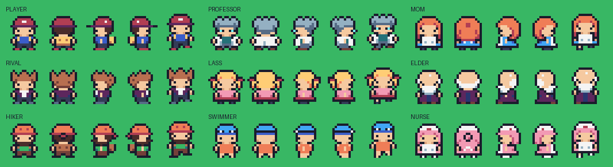
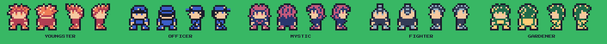
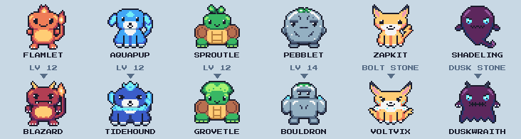

# Assets: placeholders now, real art and audio later

Apart from five townsfolk (below), the project uses no downloaded art or
audio. Everything visible or audible is drawn or generated in code, and each
piece can be swapped for real assets independently.

## What's generated, and how to replace it

| Thing | Generated by | Replace by |
|---|---|---|
| Overworld tiles | `PixelArt.overworld_tiles()` → `assets/placeholder/tiles/overworld_tiles.png` | Painting over that PNG (same 8 × 4 layout of 16 × 16 tiles), or building a new TileSet from a real tileset |
| Player / NPC sprites | Hand-drawn parts in `CharacterDesigns`, combined by `PixelArt.CHARACTERS` → `assets/placeholder/characters/*.png` (see below) | A 48 × 64 sheet: 3 columns (stand, step A, step B) × 4 rows (down, up, left, right) |
| CUT tree, boulder, sign, surf mount | `PixelArt.*()` → `assets/placeholder/objects/` | Same-size PNGs |
| Monsters | Hand-drawn in `MonsterDesigns`, colored by `PixelArt.MONSTERS` → `assets/placeholder/monsters/<id>.png` and `<id>_back.png` (see below) | Front and back sprites, set on the species' `front_texture` / `back_texture`. Battles draw 32 × 32 art at 2× and 64 × 64 art (most packs) at 1× |
| Catching orbs | `PixelArt.orb(top, accent)` → `assets/placeholder/items/<id>.png` | 16 × 16 sprites, set on the item's `icon` |
| Battle background | `PixelArt.battle_background()` → `assets/placeholder/battle/background.png` | A 240 × 160 image with the platforms in the same spots |
| Sound effects | `ChipSynth.sfx(id)` at runtime | `assets/audio/sfx/<id>.ogg` / `.wav` (see `assets/audio/README.md`) |
| Music | `Chiptune.render(Songs.*)` on a worker thread | `assets/audio/music/<id>.ogg`, with Loop enabled on import |

Regenerate the placeholders at any time with `tools/rebuild_placeholders.sh`.

> **Sprite size note.** The placeholders use 16 × 16 overworld characters,
> like the Game Boy Color games. Emerald-style 16 × 32 sprites work too:
> change `hframes`/`vframes` to match the sheet and set the `Sprite2D`
> offset to `(0, -8)` so the feet stay on the tile.

## The cast

Nine 16 × 16 characters, hand-drawn for this project in the same palette as
the tiles: PLAYER, PROFESSOR, MOM, RIVAL, LASS, ELDER, HIKER, SWIMMER and
NURSE. RIVAL and NURSE aren't placed in a map yet; they're ready for rival
battles and the Monster Center.

Each one is a **head** plus a **body** from `scripts/art/character_designs.gd`
(e.g. PROFESSOR = messy hair with glasses + lab coat), recolored by a palette
in `PixelArt.CHARACTERS`. To add someone new:

1. Pick a head and body, or draw new ones in `CharacterDesigns`. They're
   ASCII grids where each letter is a palette color.
2. Add a line to `PixelArt.CHARACTERS` with their colors.
3. Run `tools/rebuild_placeholders.sh`. The sheet lands in
   `assets/placeholder/characters/npc_<id>.png`, ready for an NPC's
   `sprite_sheet`.

**Using a downloaded pack instead.** Arrange each character as a 48 × 64 PNG
in the layout above and overwrite the file. Packs often order rows or frames
differently (e.g. 4 walk frames, or up/down swapped), so either rearrange the
sheet in an editor like Pixelorama, or change `hframes`/`vframes` on the
`Sprite2D` and the frame math in `GridActor._update_frame()`.

## Townsfolk

Five extra NPCs come from a downloaded 16 × 16 NES-style character sheet,
kept in `assets/characters/townsfolk/source/`:

| NPC | Where |
|---|---|
| GARDENER | Emberfall Town, by the flower bed |
| YOUNGSTER, FIGHTER | Route 1 |
| OFFICER, MYSTIC | Tidewater City |

`tools/import_townsfolk.gd` cuts each character out of the sheet and
rearranges it into the game's 48 × 64 layout. The sheet's rows are down,
right and up, so the left-facing row is mirrored from the right. It also
swaps the sheet's NES colors for the game's palette and turns the outer edge
into the same ink outline the cast uses. The results land in
`assets/characters/townsfolk/<id>.png`, and `tools/build_world.gd` looks
there before the drawn cast when an NPC names a sprite.

The sheet has three more characters. Two are bald base bodies, and the gold
one's hair and outfit share one color, so it reads as a blob at 1×. To use
one anyway:

1. Add a line to `TOWNSFOLK` in the tool: its block in the sheet and a
   palette color for each of its colors (outline color first). Unmapped
   colors come out magenta.
2. Run the tool, then `godot --headless --path . --import`.
3. Name the id as an NPC sprite in `tools/build_world.gd`.

## The monsters

Each monster has a 32 × 32 front sprite (the wild side of a battle, menus and
the starter choice) and a back sprite (your side of a battle). They're drawn
as ASCII grids in `scripts/art/monster_designs.gd`, where each letter is a
color from the monster's line in `PixelArt.MONSTERS`. The outer outline is
added automatically, so a design only paints the inside. To add one:

1. Copy a design in `MonsterDesigns` and redraw it. Keep the outermost rows
   and columns empty for the outline.
2. Add its colors to `PixelArt.MONSTERS`.
3. Run `tools/rebuild_placeholders.sh`.

No time to draw yet? Add `&"newmon": [seed, &"fire"]` to
`PixelArt.GENERATED_MONSTERS` for a generated stand-in, and try seeds until
one looks right.

**Using a downloaded pack instead.** Select the species in `data/species/`
and set `front_texture` and `back_texture` to the pack's PNGs. 64 × 64
sprites (isaiah658, Tuxemon) work as they are. For a pack with front sprites
only, a mirrored copy of the front makes a passable back sprite.

## Free sources

Licenses change. Always re-check the page before shipping, and keep a
`CREDITS.md` even for CC0 (attribution is appreciated).

### Tilesets & overworld sprites (16 × 16)

| Pack | License | Notes |
|---|---|---|
| [Ninja Adventure Asset Pack](https://pixel-boy.itch.io/ninja-adventure-asset-pack) (pixel-boy & AAA) | **CC0** | Best all-in-one match: top-down 16 × 16 tilesets, 50+ characters, 30+ monsters, music, 100+ SFX, fonts, and Godot examples |
| [Tiny Town](https://kenney.nl/assets/tiny-town) (Kenney) | **CC0** | 16 × 16 town tiles: buildings, terrain, foliage. Pairs with Tiny Dungeon |
| [Zelda-like tilesets and sprites](https://opengameart.org/content/zelda-like-tilesets-and-sprites) (ArMM1998) | **CC0** | 16 × 16 overworld, cave and indoor tiles, plus a character |
| [DawnLike 16 × 16 Universal Rogue-like tileset](https://opengameart.org/content/dawnlike-16x16-universal-rogue-like-tileset-v181) (DragonDePlatino, DawnBringer) | CC-BY 4.0 | Huge set with 400+ creatures. Attribution required (read the readme's conditions) |

### Overworld characters

These came up in a search for free 4-direction walking sprites at roughly
this size. They're hosted on OpenGameArt and itch.io, which this project's
build environment couldn't reach, so the licenses below come from the search
listings. Confirm on each page before using one.

| Pack | License | Notes |
|---|---|---|
| [Simple Character Base [16x16]](https://opengameart.org/content/simple-character-base-16x16) | **CC0** | A Pokémon-style overworld base; good for making many trainers |
| [Basic 16x16 character sprites, 4 directional](https://opengameart.org/content/basic-16x16-character-sprites-4-directional) | **CC0** | Standing and walking, plus swimming and other animations |
| [16x16 8-bit RPG character set](https://opengameart.org/content/16x16-8-bit-rpg-character-set) | **CC0** | Seven walking characters in NES/Famicom palette limits |
| [16x16 base sprites](https://opengameart.org/content/16x16-base-sprites) | **CC0** | Male and female bases, 6-frame walk in 4 directions |
| Ninja Adventure (above) | **CC0** | 50+ animated 16 × 16 characters |
| [Twelve more 16x18 RPG character sprites](https://opengameart.org/content/twelve-more-16x18-rpg-character-sprites) (Antifarea) | CC-BY (credit Antifarea and link OpenGameArt) | Classic JRPG townsfolk; 16 × 18, so set the sprite offset up 1-2 px |
| [16x16 RPG character sprite sheet](https://route1rodent.itch.io/16x16-rpg-character-sprite-sheet) (javikolog) | CC BY-SA 4.0 | **Share-alike**: derived art must use the same license |

### Monster art

| Pack | License | Notes |
|---|---|---|
| [50+ Monsters Pack 2D](https://opengameart.org/content/50-monsters-pack-2d) (isaiah658) | **CC0** | Best match: 56 monsters with front **and** back battle sprites at 64 × 64, each in black plus 4 colors, with an alternate "shiny" palette |
| [isaiah658's Pixel Pack #2](https://opengameart.org/content/isaiah658s-pixel-pack-2) | **CC0** | Made for a monster-catching game: more front/back monsters, battle backgrounds, attack animations, characters, towns and UI |
| [Tiny Creatures](https://clintbellanger.itch.io/tiny-creatures) (Clint Bellanger), also [on OpenGameArt](https://opengameart.org/content/tiny-creatures) | **CC0** | 180 creatures at 16 × 16 in Kenney's Tiny style. Great as party icons or overworld followers |
| Ninja Adventure (above) | **CC0** | Animated monsters and bosses |
| [Tuxemon Set 1: 154 monsters](https://opengameart.org/content/tuxemon-set-1-154-monsters-front-and-back-sprites-and-menu-animations) | CC-BY-SA 4.0 | Front and back battle sprites from the open-source Tuxemon project. **Share-alike**: derivative art must use the same license |

### Sound effects

| Pack | License | Notes |
|---|---|---|
| [512 Sound Effects (8-bit style)](https://opengameart.org/content/512-sound-effects-8-bit-style) (Juhani Junkala / SubspaceAudio) | **CC0** | Organized retro SFX: menus, hits, pickups, movement |
| Ninja Adventure (above) | **CC0** | 100+ SFX |
| [Music Jingles](https://kenney.nl/assets/music-jingles) (Kenney) | **CC0** | 85 short jingles, including 8-bit ones (item get, level up, healed) |

### Music

| Pack | License | Notes |
|---|---|---|
| [15 Melodic RPG Chiptunes](https://opengameart.org/content/15-melodic-rpg-chiptunes) (Aureolus_Omicron) | **CC0** | Loopable town and dungeon themes, OGG + MIDI |
| [CC0 Chiptunes](https://opengameart.org/content/cc0-chiptunes) / [CC0 Music](https://opengameart.org/content/cc0-music-0) | **CC0** (per track, check each) | Curated OpenGameArt collections |
| Ninja Adventure (above) | **CC0** | 37 tracks |

### Tools to make your own

- [jsfxr](https://sfxr.me/): browser sfxr. Hit a preset, tweak, export WAV.
- [ChipTone](https://sfbgames.itch.io/chiptone) (SFB Games): richer free SFX synth.
- [BeepBox](https://www.beepbox.co/): free browser chiptune composer, exports WAV.
- [Pixelorama](https://github.com/Orama-Interactive/Pixelorama): free, open-source pixel editor built with Godot (sprites, animation, tilemaps).

## Search terms that work

On itch.io use the **Free** and **Assets** filters. On OpenGameArt, filter
License = CC0.

- Tiles: `16x16 top down tileset`, `gbc rpg tileset`, `pokemon-like tileset`,
  `monster tamer tileset`, `16x16 overworld cc0`
- Characters: `16x16 rpg character 4 direction walk`, `top down npc pack`
- Monsters: `monster tamer sprites`, `creature collector sprites`,
  `64x64 monster battle sprites`, `16x16 creatures cc0`
- Audio: `chiptune rpg town loop cc0`, `8-bit route theme`,
  `nes style sound effects cc0`, `retro menu sfx`

**Avoid ripped Nintendo/Game Freak assets** (Spriters Resource and similar
"Pokémon tileset" uploads), even for a free project. They are copyrighted and
get games taken down. Mechanics can't be owned. Assets can.
